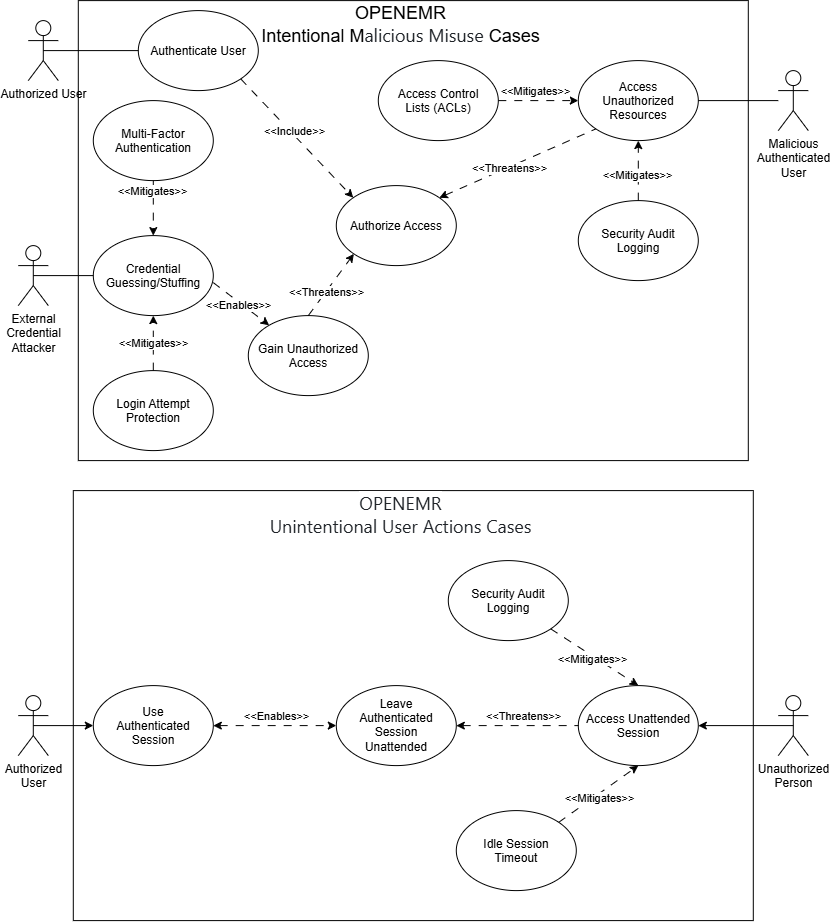

# Part 1 – OpenEMR Use Case and Misuse Case Analysis

## Operational Environment

OpenEMR operates within a healthcare environment that includes human users, hosting infrastructure, network and security controls, patient-facing systems, external healthcare systems, and business services. These components interact with OpenEMR across different trust boundaries and may introduce security risks that must be considered when developing security requirements.

The following five use/misuse-case analyses examine essential interactions between OpenEMR and its operational environment.

---

## 1. Network and Security Environment

### Essential Interaction: Secure User Authentication and Access

The Network and Security Environment includes the Internet/LAN, firewall, TLS certificates, authentication, access control, and monitoring mechanisms that support secure communication with and access to OpenEMR.

This analysis focuses specifically on the interaction between OpenEMR and the authentication, access-control, session-security, and monitoring mechanisms within this environment. An essential interaction occurs when a user authenticates to OpenEMR and attempts to access system resources. OpenEMR verifies the user's identity, while access controls determine which functions and information the authenticated user is permitted to access.

The analysis considers both **intentional/malicious misuse** and **unintentional user actions**.

### Use/Misuse Case Analysis

The primary legitimate actor is an **Authorized User** who authenticates to OpenEMR and accesses resources permitted by the user's assigned privileges.

Two intentional threat scenarios were identified:

- An **External Credential Attacker** does not possess legitimate OpenEMR access and attempts credential guessing or credential stuffing against the authentication mechanism to gain unauthorized access to an OpenEMR account.
- A **Malicious Authenticated User** represents an employee or other legitimate user who intentionally abuses authorized access by attempting to access patient information or system functions outside the privileges or legitimate purpose of the account.

Authorized users may also create security risks without malicious intent. For example, an employee using a shared workstation or check-in terminal may leave an authenticated OpenEMR session unattended. Another person could then access the active session without having to authenticate independently.

The following diagram presents both the intentional and unintentional misuse scenarios and the OpenEMR security controls that mitigate the identified risks.

The intentional misuse analysis identifies security controls including multi-factor authentication, login-attempt protection, Access Control Lists (ACLs), and security audit logging. The unintentional misuse analysis identifies idle session timeout and security audit logging as controls that reduce the risk associated with unattended authenticated sessions.

### Derived Security Requirements

- **SR-1:** OpenEMR shall support multi-factor authentication for user authentication to reduce the risk of unauthorized access resulting from compromised or guessed credentials.
- **SR-2:** OpenEMR shall limit repeated failed authentication attempts by tracking failed logins and restricting further authentication attempts after a configured threshold is reached.
- **SR-3:** OpenEMR shall enforce access controls that restrict authenticated users to system functions and information permitted by their assigned roles and privileges.
- **SR-4:** OpenEMR shall record security-relevant user and authentication activity in audit logs to support monitoring, accountability, and investigation of unauthorized access.
- **SR-5:** OpenEMR shall automatically terminate an authenticated session after a configurable period of inactivity to reduce the risk of unauthorized access through an unattended workstation.

### OpenEMR Alignment

The security requirements derived from the misuse-case analysis align with functionality currently provided by OpenEMR:

- **SR-1 – Multi-Factor Authentication:** OpenEMR provides multi-factor authentication functionality, including TOTP and U2F authentication methods.
- **SR-2 – Login Attempt Protection:** OpenEMR provides brute-force login protections that can restrict repeated failed authentication attempts.
- **SR-3 – Access Control:** OpenEMR uses Access Control Lists (ACLs) to restrict access according to assigned roles and privileges.
- **SR-4 – Audit Logging:** OpenEMR provides security auditing functionality for recording security-relevant activity.
- **SR-5 – Idle Session Timeout:** OpenEMR provides a configurable idle session timeout that terminates an authenticated session after a period of inactivity, reducing the risk associated with unattended workstations.

### Sources

- [OpenEMR Multi-factor Authentication](https://www.open-emr.org/wiki/index.php/Multi-factor_Authentication)
- [OpenEMR Brute Force Login Prevention](https://www.open-emr.org/wiki/index.php/Brute_Force_Login_Prevention)
- [OpenEMR Access Controls Listing](https://www.open-emr.org/wiki/index.php/Access_Controls_Listing)
- [OpenEMR ACL Help Source Code](https://github.com/openemr/openemr/blob/master/Documentation/help_files/adminacl_help.php)
- [OpenEMR Auditing Documentation](https://www.open-emr.org/wiki/index.php/3.1_Auditing_in_OpenEMR)
- [OpenEMR Administration Globals](https://www.open-emr.org/wiki/index.php/Administration_Globals)

---

## 2. Patient Portal

### Essential Interaction: Patient Access to Health Information and Portal Services

The Patient Portal provides patients with access to information and services made available through OpenEMR. Depending on the portal configuration, patients may log in, view laboratory results, update personal information, and send secure messages.

This analysis focuses on the interaction between a **Patient** and the OpenEMR Patient Portal. The patient has legitimate access to information and functions associated with the patient's account.

### Use/Misuse Case Analysis

The primary legitimate actor is a **Patient** who authenticates to the Patient Portal and uses the functions made available through the patient's account.

The following legitimate use cases were identified:

- Log Into Portal
- View Lab Results
- Update Personal Information
- Send Secure Message

The misuse analysis considers an attacker who obtains or attempts to obtain a patient's credentials in order to access patient information, modify information, or impersonate the patient.

The following misuse cases were identified:

- Steal Credentials
- Access Unattended Session
- Intercept Data in Transit
- Change Patient Information Illegitimately
- Impersonate Patient in Messaging

The following diagram presents the Patient Portal use cases and associated misuse cases.

### Derived Security Requirements

- **SR-6:** OpenEMR shall support multi-factor authentication for patients accessing the Patient Portal.
- **SR-7:** OpenEMR shall restrict patient access to medical records associated with the authenticated patient's account.
- **SR-8:** OpenEMR shall encrypt communications between the Patient Portal and the user's web browser.
- **SR-9:** OpenEMR shall terminate Patient Portal sessions after a configurable period of inactivity.
- **SR-10:** OpenEMR shall record successful and unsuccessful patient authentication attempts in an audit log.

### OpenEMR Alignment

The security requirements derived from the Patient Portal misuse-case analysis were compared with current OpenEMR functionality and documentation.

- **SR-6 – Patient Multi-Factor Authentication:** **Not Supported.** Current OpenEMR development information identifies Patient Portal MFA as a capability that is not currently available. Patient Portal authentication currently uses a username and password with optional reCAPTCHA.
- **SR-7 – Patient Access Control:** **Supported.** OpenEMR's Patient Portal and API authorization mechanisms associate patient access with the authenticated patient's context and provide patient-specific authorization controls. Recent security work also demonstrates that OpenEMR treats cross-patient access as an authorization violation.
- **SR-8 – Encrypted Communications:** **Supported.** OpenEMR security documentation recommends HTTPS for Internet-facing OpenEMR deployments, and its API documentation requires SSL/TLS for OAuth2 communications.
- **SR-9 – Patient Session Timeout:** **Partially Supported.** OpenEMR provides configurable idle-session timeout functionality and implements session-management controls. However, the reviewed documentation does not clearly document a separate Patient Portal-specific inactivity timeout. This represents an area where the Patient Portal documentation could be clearer.
- **SR-10 – Authentication Audit Logging:** **Partially Supported.** OpenEMR provides an auditing framework that includes login/logout, session timeout, account lockout, and other security-relevant events. However, current development work for Patient Portal MFA specifically identifies portal MFA success/failure audit logging as functionality that would need to be added with Patient Portal MFA.

### Sources

**[Add OpenEMR documentation/codebase sources used to verify SR-6 through SR-10.]**

---

## 3. Human User – Physician

### Essential Interaction: Physician Access to Clinical Functions

Physicians interact with OpenEMR to authenticate, access patient medical records, document clinical encounters, and submit electronic prescriptions. These interactions involve access to Protected Health Information (PHI) and clinical functions that require appropriate authentication, authorization, session security, and input protection.

This analysis focuses on the interaction between a **Physician** and OpenEMR's clinical functions.

### Use/Misuse Case Analysis

The primary legitimate actor is a **Physician** who authenticates to OpenEMR and performs authorized clinical activities.

The following legitimate use cases were identified:

- Authenticate Physician Session
- View Patient Medical Record
- Record Encounter Note
- Submit Electronic Prescription

The misuse analysis considers attacks against the physician's authenticated session, patient-record access, clinical input fields, and electronic prescribing functions.

The following misuse cases were identified:

- Hijack Active Session
- Enumerate Unassigned Patient Records via IDOR
- Inject SQL/XSS Payloads into Encounter Forms
- Forge Prescription Orders via Unchecked Endpoints

The following diagram presents the Physician use cases, misuse cases, and associated security controls.

### Derived Security Requirements

- **SR-11:** OpenEMR shall provide appropriate authentication and session-security controls for users assigned to the Physician role, including multi-factor authentication and configurable session expiration.
- **SR-12:** OpenEMR shall protect authenticated session cookies using appropriate HTTPS and browser cookie security controls.
- **SR-13:** OpenEMR shall enforce access-control checks when a physician requests patient records to prevent unauthorized access to patient information.
- **SR-14:** OpenEMR shall record security-relevant access to and modification of Protected Health Information (PHI) in audit logs.
- **SR-15:** OpenEMR shall validate and sanitize user-supplied clinical data and use secure database-query mechanisms to reduce SQL injection and Cross-Site Scripting (XSS) risks.
- **SR-16:** OpenEMR shall safely encode user-supplied content before rendering clinical information in web interfaces.
- **SR-17:** OpenEMR shall enforce appropriate authorization checks before processing electronic prescription requests.
- **SR-18:** OpenEMR shall provide additional authentication controls when required for sensitive electronic prescription transactions.

### OpenEMR Alignment

The security requirements derived from the Physician misuse-case analysis were compared with current OpenEMR functionality, documentation, and security guidance.

- **SR-11 – Authentication and Session Security:** **Supported.** OpenEMR provides multi-factor authentication for practitioner-side users and a configurable idle-session timeout. MFA currently requires users to enroll themselves and is not mandatory for all practitioner accounts by default.
- **SR-12 – Session Cookie Protection:** **Supported in Principle.** OpenEMR's security and API documentation requires or recommends HTTPS/TLS for secure deployments and identifies HttpOnly and Secure cookies as appropriate mechanisms for protecting authentication information.
- **SR-13 – Patient Record Access Control:** **Supported.** OpenEMR implements Access Control Lists (ACLs) and API authorization checks that restrict access to patient information according to assigned permissions.
- **SR-14 – PHI Audit Logging:** **Supported.** OpenEMR's auditing functionality includes patient-record creation, viewing, updating, and deletion and records information including the date/time, event type, user identity, patient identifier, and outcome.
- **SR-15 – Input and Database Security:** **Supported.** OpenEMR's codebase security guidance instructs developers to use binding/placeholders in SQL calls to prevent SQL injection and provides secure mechanisms for handling user-supplied data.
- **SR-16 – Output Encoding:** **Supported.** OpenEMR's codebase security guidance provides output-encoding functions for HTML, attributes, text, and JavaScript contexts to reduce Cross-Site Scripting risks.
- **SR-17 – Electronic Prescription Authorization:** **Partially Supported.** OpenEMR defines a `patients:rx` ACL for prescription functionality and uses it to restrict prescription access. However, a current OpenEMR security issue identifies an electronic-prescribing endpoint where authentication is enforced but the corresponding server-side authorization check is missing.
- **SR-18 – Prescription Re-authentication:** **Not Identified.** OpenEMR provides authentication and access-control mechanisms for electronic prescribing; however, the review did not identify OpenEMR documentation or code establishing that a physician must re-authenticate immediately before submitting a sensitive electronic prescription. This requirement therefore represents an area where additional transaction-level authentication controls may be appropriate.

### Sources

- [OpenEMR Multi-factor Authentication](https://www.open-emr.org/wiki/index.php/Multi-factor_Authentication)
- [OpenEMR Securing OpenEMR]((https://www.open-emr.org/wiki/index.php/Securing_OpenEMR))
- [OpenEMR Access Controls Listing](https://www.open-emr.org/wiki/index.php/Access_Controls_Listing)
- [OpenEMR Administration Globals](https://www.open-emr.org/wiki/index.php/Administration_Globals)

---

## 4. Nurse Interaction

### Essential Interaction: Nurse Access to Patient and Clinical Information

A nurse interacts with OpenEMR to access patient information and perform authorized clinical activities. Although nurses may interact with additional OpenEMR functionality, this analysis focuses on three representative interactions involving patient records, encounter documents, and prescription information.

### Use/Misuse Case Analysis

The primary legitimate actor is a **Nurse** who uses OpenEMR to perform authorized clinical activities.

The following legitimate use cases were identified:

- Search Patient Record
- Manage Encounter Documents
- Enter Prescription Information

The misuse analysis considers a **Rogue Staff Member** with privileges below those assigned to the nurse who attempts to abuse OpenEMR functionality or circumvent security controls.

The following misuse cases were identified:

- Prescription Tampering
- Stored Cross-Site Scripting (XSS)
- SQL Injection
- Unauthorized Access

The following diagram presents the Nurse use cases, misuse cases, and associated security controls.

### Derived Security Requirements

- **SR-19:** OpenEMR shall use parameterized queries with bound parameters for database operations involving user-supplied input.
- **SR-20:** OpenEMR shall apply appropriate output encoding to user-supplied content before rendering it in the user interface.
- **SR-21:** OpenEMR shall enforce fine-grained access controls so authenticated users can access only patient records and encounter documents for which they are authorized.
- **SR-22:** OpenEMR shall consistently enforce encounter-sensitivity authorization checks at encounter-related entry points.
- **SR-23:** OpenEMR shall verify that a user is authorized to enter or modify prescription information before permitting the operation.
- **SR-24:** OpenEMR shall maintain an audit log of prescription-related activities, including the user identity, action performed, affected record, and timestamp.
### OpenEMR Alignment

The security requirements derived from the Nurse misuse-case analysis were compared with OpenEMR security guidance and implementation observations.

- **SR-19 – SQL Injection Protection:** **Supported.** OpenEMR's codebase security guidance recommends using binding and placeholders for SQL calls involving user-supplied data, which aligns with the requirement for parameterized queries.
- **SR-20 – XSS Protection:** **Supported.** OpenEMR's security guidance provides output-encoding functions for safely presenting user-supplied content and reducing Cross-Site Scripting risks.
- **SR-21 – Access Control:** **Partially Supported.** OpenEMR implements Access Control Lists (ACLs) for restricting access to patient information. However, authorization must be consistently enforced at each protected entry point to prevent lower-privileged users from accessing information outside their permissions.
- **SR-22 – Encounter Sensitivity:** **Partially Supported.** OpenEMR provides ACL mechanisms capable of enforcing authorization restrictions, but consistent enforcement is required throughout encounter-related functionality.
- **SR-23 – Prescription Authorization:** **Supported with Limitations.** OpenEMR defines a `patients:rx` permission for prescription functionality and applies prescription ACL checks in multiple areas of the application. Current OpenEMR security findings, however, demonstrate that authorization checks have not always been consistently applied to every prescription-related endpoint.
- **SR-24 – Audit Logging:** **Supported.** OpenEMR implements audit logging for security-relevant activity. Audit records can include the event date and time, event type, user identity, patient identifier, and event outcome.

### Sources

- [Codebase_Security](https://www.open-emr.org/wiki/index.php/Codebase_Security)
- [Overview OpenEMR](https://github.com/openemr/openemr/security?page=1)
- [OpenEMR Features](https://www.open-emr.org/wiki/index.php/OpenEMR_Features)
- [Access Control Listing](https://www.open-emr.org/wiki/index.php/Access_Controls_Listing#Encounter_Information_(encounters))
- [ACL Fine Granular Control](https://www.open-emr.org/wiki/index.php/ACL_Fine_Granular_Control)
- [Audit Control](https://www.open-emr.org/wiki/index.php/4._Audit_Control?utm_source=chatgpt.com)

---

## 5. External Health System – Pharmacy

### Essential Interaction: Electronic Prescription Exchange

An external pharmacy interacts with OpenEMR to exchange electronic prescription information. Because electronic prescriptions contain Protected Health Information (PHI) and medication information, unauthorized access or modification could affect patient privacy, patient safety, and regulatory compliance.

This analysis focuses on the interaction between an **External Pharmacy Technician** and OpenEMR during electronic prescription and refill activities.

### Use/Misuse Case Analysis

The primary legitimate actor is an **External Pharmacy Technician** who interacts with OpenEMR through electronic prescription functions.

The following legitimate use cases were identified:

- Receive Electronic Prescription
- Request Prescription Refill
- Verify Prescription Information

The misuse analysis considers a **Hacker (Prescription Fraudster)** attempting to compromise prescription information or abuse the electronic prescription process.

The following misuse cases were identified:

- Prescription Tampering
- Fraudulent Refill Request
- Unauthorized Prescription Access
- Malicious SQL Injection

The following diagram presents the External Pharmacy use cases, misuse cases, and associated security controls.

### Derived Security Requirements

- **SR-25:** OpenEMR shall authenticate external pharmacy systems before transmitting prescription information.
- **SR-26:** OpenEMR shall ensure that only authorized pharmacies may access prescription records associated with their patients.
- **SR-27:** OpenEMR shall encrypt prescription information while in transit.
- **SR-28:** OpenEMR shall maintain an audit log of prescription creation, modification, transmission, and refill activities.
- **SR-29:** OpenEMR shall use parameterized queries when processing externally supplied data.
- **SR-30:** OpenEMR shall encode user-supplied data before presentation to reduce the risk of stored Cross-Site Scripting (XSS).

### OpenEMR Alignment

The security requirements derived from the External Pharmacy misuse-case analysis were compared with OpenEMR functionality and documented security controls.

- **SR-25 – Pharmacy Authentication:** **Partial.** OpenEMR provides security mechanisms for electronic prescription interactions, but additional pharmacy-specific authentication controls could strengthen this interaction.
- **SR-26 – Authorization:** **Supported.** OpenEMR provides role-based access-control functionality for restricting access to protected resources.
- **SR-27 – Encryption in Transit:** **Supported.** OpenEMR supports encrypted communications for protecting sensitive information in transit.
- **SR-28 – Audit Logging:** **Supported.** OpenEMR provides audit-logging functionality for recording security-relevant activities.
- **SR-29 – SQL Injection Protection:** **Supported.** OpenEMR's secure-development guidance recommends protections such as parameterized queries for database operations.
- **SR-30 – XSS Prevention:** **Supported.** OpenEMR's secure-development guidance includes protections for handling and presenting user-supplied data to reduce Cross-Site Scripting risks.

Although OpenEMR provides controls that address many of these requirements, interaction with an external pharmacy still depends on those controls being properly implemented and configured to protect prescription information from unauthorized access or modification.

### Sources

**[Add Erik's OpenEMR documentation/codebase sources here.]**

---

## Part 1 Summary

The five use/misuse-case analyses demonstrate how security risks can emerge across different interactions within the OpenEMR operational environment. The identified misuse cases include credential theft, unauthorized access, session misuse, injection attacks, prescription tampering, and abuse of legitimate privileges. These scenarios show that security requirements must address both external attackers and users who may intentionally or unintentionally misuse system access.

The resulting security requirements emphasize authentication, access control, session security, encryption, audit logging, secure input handling, and authorization of sensitive operations. Comparing these requirements with OpenEMR's existing functionality also identifies areas where current security controls align with the requirements as well as areas where additional functionality or documentation could improve security.

---

# Part 2 – OpenEMR Security Documentation Review

## Multi-Factor Authentication Documentation

For the security documentation review, the team examined OpenEMR's Multi-factor Authentication (MFA) documentation and compared it with current OpenEMR development information. The review identified several areas where the documentation could provide administrators with clearer information about MFA configuration, capabilities, and limitations.

### 1. MFA Prerequisites and Hardware Authentication

The MFA documentation would benefit from a clearly identified prerequisites section describing applicable OpenEMR versions, HTTPS requirements, browser compatibility, and supported authentication devices.

The documentation should also clarify the status of hardware-based authentication. OpenEMR currently includes U2F functionality, while current development discussions identify WebAuthn as the modern successor to the existing U2F implementation. Clearer documentation would help administrators understand which hardware authentication methods are currently supported and which technologies are planned for future development.

### 2. Practitioner MFA Enforcement

The documentation should clearly explain that MFA enrollment for practitioner-side users is currently self-service. OpenEMR does not currently provide an administrator setting that requires all practitioner users to enroll in MFA.

Users who have not enrolled in MFA can therefore continue authenticating with their password without being forced to configure a second authentication factor. This limitation is important for organizations whose security policies require MFA for all practitioner accounts.

### 3. Patient Portal MFA

The documentation should explicitly distinguish practitioner-side MFA from Patient Portal authentication. Current OpenEMR development information indicates that the Patient Portal does not currently provide MFA. Patient authentication uses a username and password with optional reCAPTCHA.

Clearly documenting this distinction would prevent administrators from assuming that OpenEMR's existing MFA functionality also protects Patient Portal accounts.

### 4. Administrative MFA Reset

The "Cancel User MFA" documentation should be reviewed to ensure that it reflects the current supported administrative procedure. Existing MFA documentation describes directly removing a user's MFA registration from the database.

Current OpenEMR development information references administrative MFA management through `usergroup_admin.php`. The documentation should clearly identify the preferred supported method for resetting or clearing a user's MFA registration and avoid recommending direct database modification when an administrative interface is available.

## Recommended Documentation Improvements

Based on the review, OpenEMR's MFA documentation could be improved by:

- Adding a prerequisites section covering OpenEMR version, HTTPS, browser, and authentication-device requirements.
- Clearly documenting the current limitations of practitioner-side MFA enforcement.
- Explicitly distinguishing practitioner MFA from Patient Portal authentication.
- Updating administrative MFA-reset instructions to reflect the current supported workflow.
- Clarifying the status of U2F hardware authentication and the transition toward newer WebAuthn/FIDO2 authentication methods.

These changes would provide administrators with a clearer understanding of how OpenEMR MFA should be configured, where it currently applies, and what limitations should be considered when developing an organization's authentication policies.

## Sources

- [OpenEMR Multi-factor Authentication](https://www.open-emr.org/wiki/index.php/Multi-factor_Authentication)
- [OpenEMR Issue #12033 – Add force_mfa global to require enrollment for all users](https://github.com/openemr/openemr/issues/12033)
- [OpenEMR Issue #12034 – Add multi-factor authentication to Patient Portal](https://github.com/openemr/openemr/issues/12034)
