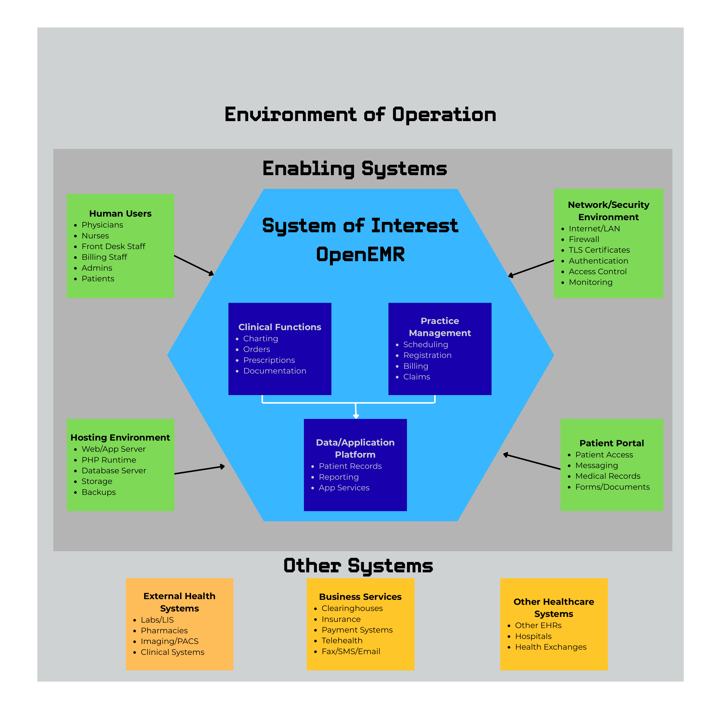

# OpenEMR Security Enhancement Project Proposal

## Open-Source Project Description

OpenEMR is a free and open-source electronic health records and medical practice management application. It is ONC Certified and features fully integrated electronic health records, practice management, scheduling, electronic billing, internationalization, free support, and an active community. It can run on Windows, Linux, macOS, and other platforms. OpenEMR's core features include patient demographics and scheduling, electronic medical records, prescriptions, medical billing, a patient portal, reports, and language and community support. Its primary programming languages include PHP, JavaScript, Shell, Ruby, and SCSS. OpenEMR is supported by the OpenEMR Foundation, a nonprofit organization involved in supporting the project and its ONC EHR certification.

OpenEMR has a contribution base consisting of independent software developers, medical professionals, system integrators, academic researchers, and volunteers. Contributions also come from companies and health-technology vendors that customize, host, and support OpenEMR for clinical practices. The OpenEMR Foundation provides organizational support for the open-source project and its community.

OpenEMR exhibits steady, long-term project activity. The project continues to receive major and minor releases that incorporate new functionality, security patches, bug fixes, and changes related to healthcare requirements. The main GitHub repository demonstrates continued development through code commits, pull requests, issue tracking, and testing.

OpenEMR is widely used as an open-source electronic health records system. According to the OpenEMR project, the software is used by healthcare facilities around the world and supports more than 100,000 medical providers serving more than 200 million patients. Its open-source model makes it an option for healthcare organizations seeking an alternative to proprietary EHR systems while maintaining greater control over their software and infrastructure.

## Motivation

As more sophisticated cybersecurity attacks occur each day, it has become critical that private healthcare data remain protected. OpenEMR provides a real-world platform to examine cybersecurity practices that are currently in place to help protect access control, authentication, and encryption and to better understand what is required to combat the risks that healthcare organizations face each day.

Through this examination, we will be able to connect cybersecurity concepts to a practical system that can help reduce risk and improve the confidentiality, integrity, and availability of patient data.

## Systems Engineering and Environment of Operation

OpenEMR operates as part of a larger healthcare and technology environment rather than as an isolated application. The team's systems-engineering diagram identifies OpenEMR as the **System of Interest** and places it within an **Environment of Operation** consisting of enabling systems and other interconnected systems.

Within OpenEMR, the diagram identifies three major functional areas:

- **Clinical Functions:** charting, orders, prescriptions, and documentation.
- **Practice Management:** scheduling, registration, billing, and claims.
- **Data/Application Platform:** patient records, reporting, and application services.

The enabling systems surrounding OpenEMR include:

- **Human Users:** physicians, nurses, front desk staff, billing staff, administrators, and patients.
- **Network/Security Environment:** Internet/LAN connectivity, firewalls, TLS certificates, authentication, access control, and monitoring.
- **Hosting Environment:** web/application server, PHP runtime, database server, storage, and backups.
- **Patient Portal:** patient access, messaging, medical records, and forms/documents.

OpenEMR also communicates with systems outside the immediate OpenEMR environment. These include external health systems such as labs/LIS, pharmacies, imaging/PACS, and clinical systems; business services such as clearinghouses, insurance, payment systems, telehealth, and fax/SMS/email; and other healthcare systems such as other EHRs, hospitals, and health exchanges.

This environment demonstrates that OpenEMR security depends not only on the application itself but also on its users, authentication mechanisms, network infrastructure, hosting environment, patient-facing systems, and connections to external healthcare and business systems.

**Figure 1. OpenEMR System of Interest and Environment of Operation**

## OpenEMR Threats and Security

### Threats

OpenEMR is a world-leading open-source medical record software used by over 100,000 healthcare providers serving more than 200 million patients. The software stores sensitive data such as patient medical records, billing information, lab results, and other healthcare information, making it a valuable target for cyberattacks.

OpenEMR operates in an environment that is susceptible to various security threats that healthcare organizations should consider when conducting security risk assessments.

### 1. Outdated Software and Vulnerabilities

In collaborative work involving the OpenEMR community and AISLE, an autonomous AI-native application security platform, 38 security vulnerabilities were discovered in the open-source software. If exploited, vulnerabilities could potentially lead to database compromise, modification of stored records, privilege escalation, and remote code execution on the server. The discovered vulnerabilities included SQL injection, cross-site scripting, path traversal, and session flaws.

### 2. Weak or Missing Access Controls

One of AISLE's findings involved endpoints that omitted Access Control List (ACL) protections, potentially allowing authenticated users to reach functionality intended for administrators.

### 3. Insecure Network Configuration

Missing or improper firewall configurations can allow an attacker to scan or directly access an OpenEMR server over the Internet or a local network.

### 4. Insufficient Logging and Monitoring

An administrator's inability to track who performed an action and when it occurred could allow insider threats or external attackers to make changes without being detected. An example occurred in versions prior to 7.0.3.4 involving CVE-2025-32967, in which password-related events were not sufficiently logged. Insufficient logging can create technical, legal, and operational consequences for healthcare organizations.

### 5. Software Supply Chain Threats

OpenEMR does not operate in isolation. It is interconnected with system elements and other systems within its operational environment. Under a supply chain threat, an attacker could target a weak link within these interconnected systems or use techniques such as typosquatting and repository hijacking to introduce malicious packages into a development pipeline. A successful supply chain compromise could have cascading effects on healthcare organizations and their patients.

### 6. Physical and Environmental Threats

OpenEMR may also face physical and environmental threats. If OpenEMR servers are maintained locally in a data center, they could be subject to physical theft or failures involving environmental controls such as HVAC, fire suppression, or uninterruptible power supplies.

When OpenEMR is deployed in a cloud environment, responsibility for much of the physical infrastructure shifts to the cloud provider. However, organizations must still consider regional outages, natural disasters, availability, backups, and how services will continue if a cloud region becomes unavailable.

## Security Features

OpenEMR systems generate, process, and maintain sensitive health information. Security features are therefore important for healthcare organizations working to satisfy applicable HIPAA/HITECH requirements and other healthcare security requirements. OpenEMR is also ONC Health IT certified.

### 1. Role-Based Access Control

The system supports the principle of least privilege by restricting access based on the permissions required to perform particular tasks. Roles can be established for users such as clinicians, billing personnel, front desk staff, and administrators.

### 2. Authentication

OpenEMR provides several authentication-related capabilities, including:

- Password security settings.
- Multi-factor authentication.
- U2F and TOTP authentication support.
- Active Directory login support.
- Google OAuth login capabilities.

### 3. Encryption of Data

OpenEMR deployments can protect data both in transit and at rest.

**Encryption in Transit**

TLS can be used to protect network traffic between users and OpenEMR.

**Encryption at Rest**

Organizations can use disk-level or database encryption to protect stored information. MySQL/MariaDB data-at-rest encryption or encrypted storage can provide additional protection. OpenEMR also includes encryption functionality related to documents and attachments and provides mechanisms for protecting audit information.

### 4. Audit Logging

OpenEMR audit trails can track security-relevant events, including:

- Logins and logouts.
- Session timeouts.
- Account lockouts.
- Patient-record activity.
- Appointments.
- Authentication failures.

Audit records can contain information such as the user ID, timestamp, patient ID, and event status.

### 5. Session Management

OpenEMR provides idle-session timeout functionality that can log users out after a period of inactivity, reducing the risk of unauthorized access through an unattended authenticated session.

## Security-Related History

OpenEMR handles sensitive healthcare information, making authentication, authorization, auditing, encryption, and protection against common web application attacks important parts of its security architecture. Throughout the project's history, security researchers have identified vulnerabilities involving SQL injection, cross-site scripting (XSS), authentication bypass, command injection, file access, improper authorization, and other security weaknesses. OpenEMR developers have responded to these discoveries through security patches, code changes, additional security controls, and vulnerability-reporting processes.

One significant period in OpenEMR's security history occurred in 2018, when researchers from Project Insecurity conducted a security assessment of OpenEMR. The assessment identified numerous vulnerabilities, including patient portal authentication bypass, SQL injection, remote code execution, information disclosure, unrestricted file uploads, cross-site request forgery (CSRF), and unauthorized administrative actions.

The researchers contacted OpenEMR about the vulnerabilities in July 2018. OpenEMR subsequently developed fixes, and the vulnerabilities were publicly disclosed in August after coordinated remediation efforts.

Several CVEs resulted from vulnerabilities affecting OpenEMR during this period. **CVE-2018-15152** involved an authentication bypass affecting versions before 5.0.1.4. **CVE-2018-15143** involved SQL injection, while **CVE-2018-15154** involved operating-system command injection. **CVE-2018-15141** involved a path-traversal vulnerability.

These vulnerabilities demonstrate the importance of authentication, input validation, authorization, and secure coding practices within an application containing sensitive medical information.

Security vulnerabilities have continued to be identified as OpenEMR has evolved. **CVE-2023-54347** involved a bypass of brute-force mitigation protections in OpenEMR 7.0.1, potentially allowing repeated authentication attempts without the intended protections.

More recent vulnerabilities have continued to demonstrate the importance of access control. **CVE-2025-67645**, affecting versions before 7.0.4, involved broken access control that could allow an authenticated user to manipulate identifiers and modify another user's profile.

**CVE-2026-32126** involved a missing authorization check affecting administrative Clinical Decision Support functionality and was addressed in OpenEMR 8.0.0.1.

Additional vulnerabilities affecting later OpenEMR releases have involved cross-site scripting, XML External Entity (XXE) processing, SQL injection, arbitrary file access, CSRF, and authorization weaknesses. OpenEMR's security advisories and Security Alert Fixes documentation provide information about these vulnerabilities and the versions in which fixes were released.

### Security Engineering Changes and Features

OpenEMR has added and improved defensive security features over time. Current functionality includes access controls, auditing and logging, encryption capabilities, and additional authentication mechanisms.

OpenEMR's auditing functionality can record security-relevant events such as:

- Login and logout activity.
- Session timeouts.
- Account lockouts.
- Patient-record access.
- PHI import and export.
- Security-administration activity.

OpenEMR has also provided deployment security recommendations involving strong and unique passwords, password-expiration policies, restrictions on uploaded files, disk encryption, removal of installation and development files, and secure web-server configuration.

The project also maintains mechanisms for security reporting and publishes information about security fixes and advisories.

### Authentication and MFA

OpenEMR currently supports several authentication mechanisms. In addition to traditional username and password authentication, OpenEMR supports additional authentication technologies and uses OAuth 2.0 and OpenID Connect for API authentication.

OpenEMR also provides multi-factor authentication for practitioner-side users. Existing MFA functionality includes **time-based one-time passwords (TOTP)** as well as **U2F** support.

Users can enroll in MFA through OpenEMR's MFA-management functionality. This means MFA itself is not a new capability that the team needs to create from scratch. Instead, the existing authentication architecture provides a foundation that can potentially be extended with additional hardware-backed authentication capabilities.

Historical authentication vulnerabilities are particularly relevant to the team's proposed security enhancement. Authentication bypass and brute-force-protection issues demonstrate the importance of protecting user accounts beyond reliance on passwords. Hardware-backed authentication provides an opportunity to strengthen this area by requiring possession of a physical authentication device in addition to knowledge-based credentials.

## License and Contribution Process

### License

OpenEMR uses two different licenses depending on the type of content.

For software, OpenEMR utilizes the **GNU General Public License (GNU GPL) v3**. This is a copyleft license, meaning redistributions of the software must remain under the applicable GPL licensing terms.

Documentation housed on the OpenEMR wiki falls under the **GNU Free Documentation License (GFDL) v1.3**. This license permits content to be reused and modified under its licensing requirements, including attribution and applicable redistribution requirements.

### How to Contribute

OpenEMR uses a structured Git workflow. Contributors begin by forking the OpenEMR repository, cloning it locally, and adding the official repository as an upstream repository.

OpenEMR uses branch-management practices in which contributors should not perform development directly on the master or release branches. Work is instead performed within custom development or feature branches.

The standard submission process involves preparing the contributor's work, pushing the branch to the contributor's fork, and submitting a **Pull Request** to the official OpenEMR repository. Integration Developers can then review the contribution before integration. Integration Developers are privileged contributors with commit access to the project.

### Contributor Agreement

OpenEMR does not use a formal contributor license agreement according to the team's research. Contributions are instead made under the project's applicable GNU GPL licensing terms.

## Proposed Security Enhancement

### Nitrokey Hardware-Backed Multi-Factor Authentication

Based on the team's research into OpenEMR's threats, existing security capabilities, authentication mechanisms, and historical vulnerabilities, the proposed security enhancement is to investigate and implement **Nitrokey hardware-backed authentication as an additional multi-factor authentication option for OpenEMR**.

OpenEMR already provides MFA capabilities, including TOTP and U2F. Therefore, the objective of the project is not simply to add MFA to OpenEMR. Instead, the project will examine how a Nitrokey hardware security device can be integrated into OpenEMR's existing authentication architecture to provide a hardware-backed authentication factor.

At a high level, the intended authentication process would be:

1. The user enters their normal OpenEMR username and password.
2. OpenEMR validates the user's primary credentials.
3. The user is required to authenticate using a registered Nitrokey hardware device.
4. After successful authentication, OpenEMR grants the authenticated user access according to the application's existing roles and permissions.

The Nitrokey would therefore strengthen **authentication**, while OpenEMR's existing role-based access controls and Access Control Lists would continue to control **authorization**. The hardware token would not replace OpenEMR's existing permissions architecture.

The initial project scope will focus on determining the most practical Nitrokey-supported authentication technology for integration with OpenEMR and implementing hardware-backed MFA within the existing authentication workflow.

Potential capabilities such as OpenPGP-based digital signatures, hardware-held encryption keys, Web of Trust functionality, cross-institution identity, and automatic session locking following physical token removal may be considered possible future extensions rather than requirements of the initial implementation.

### Security Rationale

The proposed enhancement directly relates to weaknesses identified during the team's security research. OpenEMR has historically experienced authentication-related vulnerabilities, including authentication bypass and weaknesses involving brute-force protections. Healthcare accounts can provide access to highly sensitive patient and organizational information.

Hardware-backed MFA can reduce dependence on password-only authentication by requiring users to possess a registered physical security device. This adds an additional authentication barrier if a user's password is compromised.

The proposal also builds on OpenEMR's existing security architecture rather than attempting to replace its authentication and authorization systems. This provides a more focused contribution that can be evaluated within the scope of the project.

## References

### OpenEMR Project and Documentation

OpenEMR Foundation. "OpenEMR: Open Source Electronic Health Records and Medical Practice Management."  
https://www.open-emr.org/

OpenEMR Foundation. "OpenEMR Source Code." GitHub Repository.  
https://github.com/openemr/openemr

OpenEMR Foundation. "OpenEMR Project Wiki."  
https://www.open-emr.org/wiki/

OpenEMR Community. "OpenEMR Community Forum."  
https://community.open-emr.org/

OpenEMR Wiki. "Repository Work Flow Structure."  
https://www.open-emr.org/wiki/index.php/Repository_work_flow_structure

OpenEMR Wiki. "Git for Dummies."  
https://www.open-emr.org/wiki/index.php/Git_for_dummies

OpenEMR Wiki. "Using Git with OpenEMR – Making Changes."  
https://www.open-emr.org/wiki/index.php/Using_Git_with_OpenEMR#Making_Changes

OpenEMR. "Documentation." GitHub Repository.  
https://github.com/openemr/openemr/tree/master/Documentation

### Security and Authentication

OpenEMR. "Security."  
https://github.com/openemr/openemr/security

OpenEMR. "Security Advisories."  
https://github.com/openemr/openemr/security/advisories

OpenEMR Wiki. "Security Alert Fixes."  
https://www.open-emr.org/wiki/index.php/Security_Alert_Fixes

OpenEMR Wiki. "Multi-factor Authentication."  
https://www.open-emr.org/wiki/index.php/Multi-factor_Authentication

OpenEMR Wiki. "Securing OpenEMR."  
https://www.open-emr.org/wiki/index.php/Securing_OpenEMR

OpenEMR. "API Authentication Documentation."  
https://github.com/openemr/openemr/blob/master/Documentation/api/AUTHENTICATION.md

Project Insecurity. "OpenEMR Security Assessment."  
https://www.open-emr.org/wiki/images/1/11/Openemr_insecurity.pdf

National Vulnerability Database. "CVE-2018-15152."  
https://nvd.nist.gov/vuln/detail/CVE-2018-15152

National Vulnerability Database. "CVE-2018-15143."  
https://nvd.nist.gov/vuln/detail/CVE-2018-15143

National Vulnerability Database. "CVE-2018-15154."  
https://nvd.nist.gov/vuln/detail/CVE-2018-15154

National Vulnerability Database. "CVE-2018-15141."  
https://nvd.nist.gov/vuln/detail/CVE-2018-15141

National Vulnerability Database. "CVE-2023-54347."  
https://nvd.nist.gov/vuln/detail/CVE-2023-54347

National Vulnerability Database. "CVE-2025-67645."  
https://nvd.nist.gov/vuln/detail/CVE-2025-67645

National Vulnerability Database. "CVE-2026-32126."  
https://nvd.nist.gov/vuln/detail/CVE-2026-32126

### Threat and Security Feature Research

CapMinds. "OpenEMR Security and Compliance Guide for Healthcare."  
https://www.capminds.com/blog/a-definitive-guide-to-openemr-security-compliance-for-healthcare-organizations/

AISLE. "AISLE Discovers 38 CVEs in Healthcare Software Used by 100,000 Medical Providers."  
https://aisle.com/blog/aisle-discovers-38-critical-security-vulnerabilities-in-healthcare-software-used-by-100000-providers

CapMinds. "OpenEMR Security Best Practices for Healthcare Providers."  
https://www.capminds.com/blog/5-openemr-security-best-practices-every-clinic-should-follow/

UberEther. "Secure Electronic Health Record (EHR) System: EHR Security."  
https://uberether.com/secure-ehr-system/

Dark Reading. "AI Finds 38 Security Flaws in OpenEMR."  
https://www.darkreading.com/vulnerabilities-threats/ai-finds-38-security-flaws-openemr

Accountable. "Healthcare Open Source Security: Risks, Compliance, and Best Practices."  
https://www.accountablehq.com/post/healthcare-open-source-security-risks-compliance-and-best-practices

Defensorum. "AI Finds 38 Vulnerabilities in OpenEMR Platform."  
https://www.defensorum.com/ai-vulnerabilities-openemr/

Veracode. "Open Source Supply Chain Security Best Practices."  
https://www.veracode.com/blog/open-source-supply-chain-security-best-practices/

OffSeq. "CVE-2025-32967: CWE-778: Insufficient Logging in OpenEMR."  
https://radar.offseq.com/threat/cve-2025-32967-cwe-778-insufficient-logging-in-openemr-openemr-273fad

Accountable. "OpenEMR HIPAA Compliance: Security Features, Hosting Requirements, and BAA Checklist."  
https://www.accountablehq.com/post/openemr-hipaa-compliance-security-features-hosting-requirements-and-baa-checklist
